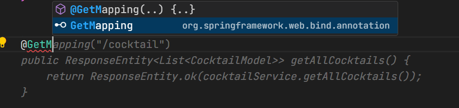
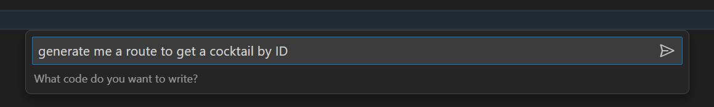
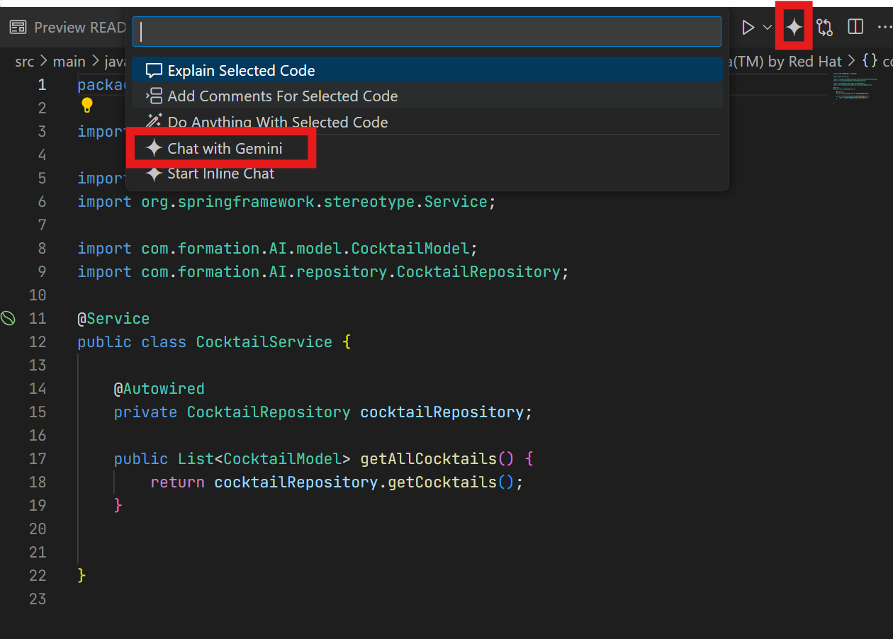
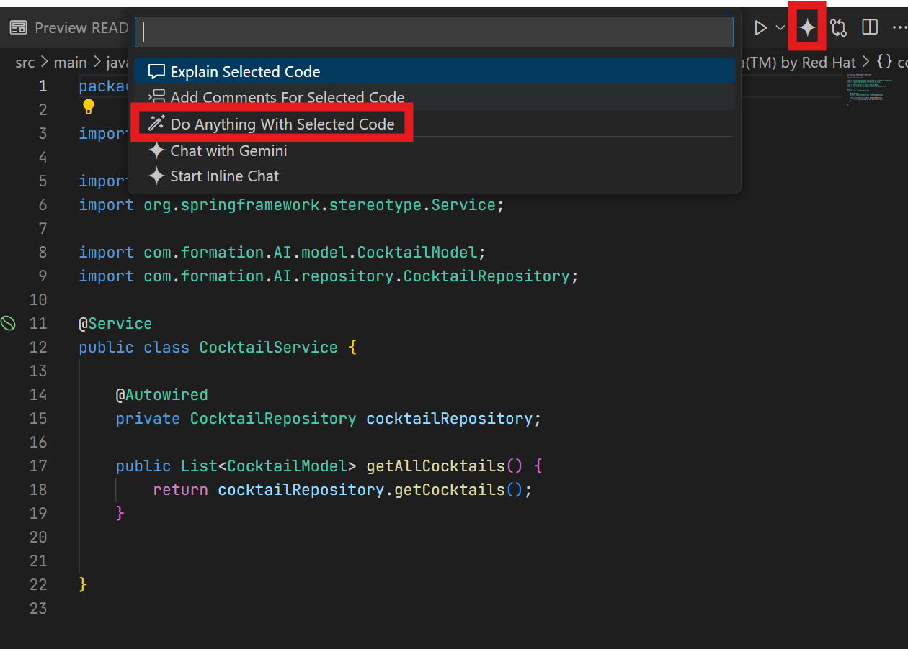

# Formation_IA

L’intelligence artificielle générative a déjà un impact significatif sur le développement informatique. Elle intervient dans des domaines tels que la génération de code, l’écriture de documentation, la création de cas de test et l’optimisation du code.

Son utilisation offre un gain de productivité important dans le développement informatique estimé à 55% par Github Copilot, l'une des premières IA génératives grands public pour le développement informatique.

Bien que ces outils présentent encore des limites tant dans les réponses fournies que sur des questions plus sensibles de sécurité, leur adoption est de plus en plus importante dans le monde informatique.

De plus, les principaux problèmes de ces outils sont déjà en cours de résolution par les équipes proposants ces solutions.

C'est dans ce cadre que cette formation vise à vous sensibiliser à l'usage des ces outils afin de vous fournir toutes les clés de compréhension tant dans leurs bénéfices que dans leurs limites.

Cette formation pratique vous invite à développer un projet Spring-Boot classique afin de découvrir et de pratiquer les différents cas d'usages que l'on peut rencontrer avec une IA générative.

Le projet a pour but d'appeler une API de coktails pour se préparer aux vacances 😎. 

La formation est divisée en 5 exercices qui vous invitent à pratiquer un cas précis détaillé dans ce README.

Chaque exercice possède sa branche qu'il faudra checkout avant de commencer.

## 01 - Génération par auto-complétion

Ce premier exercice se concentre sur une fonctionnalité phare des IA génératives de développement, l'auto-complétion automatique dans l'IDE.

Pour commencer, n'oubliez pas de checkout la branche 01-generate-with-autocomplete.

La fonctionnalité d'auto-complétion fonctionne de manière transparente dans l'IDE. 

Pour l'expérimenter créez une route /cocktail dans le [CocktailController.java](./src/main/java/com/formation/AI/controller/CocktailController.java).


Commencez par écrire un commentaire décrivant votre besoin comme par exemple : 
   
```// make a route /cocktail with @GetMapping```

Il est également possible d'écrire simplement le début de la méthode et une proposition devrait apparaître en grisé. 
    
Pour accepter une proposition faite TAB.



Pour tester que la route fonctionne, vous pouvez vous contenter de retourner un String vide et ainsi lancer le projet et exécuter la commande :

```shell
curl http://localhost:8888/cocktail
```

Une fois cette première route créée, essayez d'en faire une 'byId', l'IA devrait analyser la route que vous venez de faire afin de vous en proposer une plus rapidement.

## 02 - Génération par chat

Ce second exercice se concentre sur une fonctionnalité qui permet au développeur d'exprimer son besoin à l'IA via le langage naturel.

Pour commencer, n'oubliez pas de checkout la branche 02-generate-with-chat.

Dans l'outil IDX, il existe 2 moyens de générer du code via le langage naturel.

Le premier est de se mettre dans l'IDE et de faire ``CRTL+i``. Cette commande ouvre une fenêtre de dialogue dans laquelle vous pouvez demander à l'IA ce que vou voulez.



La deuxième solution est l'accès à un chat plus classique en cliquant en haut à droite sur l'étoile. Ce chat permet de discuter avec l'IA en lui demandant de générer du code ou expliquer une erreur par exemple. 



Pour cet exercice, vous devez compléter les classes [CocktailRepository.java](./src/main/java/com/formation/AI/repository/CocktailRepository.java) et [CocktailModel.java](./src/main/java/com/formation/AI/model/CocktailModel.java) afin d'appeler la route getAllCoktails de l'API.

### Ressources

Plusieurs ressources sont à disposition pour réaliser cet exercice.

Tout d'abord, le fichier [sample-data.json](./src/main/resources/sample-data.json) représente la structure de données renvoyée par l'api. Vous pouvez vous servir de son contenu pour demander à l'IA de vous générer un model.
Il peut être pertinent de prendre le temps de spécifier à l'IA le résultat exact souhaité. Par exemple :
``Pour le fichier sample-data.json, générer une classe CocktailModelavec tous les paramètres de la réponse JSON et annoter cette classe avec @Data de la librairie lombok.`` 

De plus, le fichier [application.properties](./src/main/resources/application.properties) contient déjà 2 endpoints de l'API que vous pouvez utiliser.
Pour utiliser ces endpoints il est nécessaire de concaténer api.url avec l'endpoint de son choix.

### 03 - Commandes intégrées

Ce troisième exercice se concentre sur les commandes intégrées du chat de l'IA.

Pour le projet IDX il en existe plusieurs qui permettent de donner un contexte l'IA via un seul mot.

Ces commandes sont accessibles dans le chat via ``CTRL+i`` ou sur l'étoile en haut à droite.

Vous pouvez par exemple essayer la commande ``/addComments`` sur la méthode getAllCocktails du repository.

Prenez le temps d'essayer les commandes disponibles pour apprécier la puissance des IA génératives.

### 04 - Générations de tests

L'IA peut également générer des tests unitaires pour du code déjà écrit. Essayer de surligner la méthode getAllCocktail de  [CocktailRepository.java](./src/main/java/com/formation/AI/repository/CocktailRepository.java) et de demander à l'IA de vous générer des tests unitaires pour le code surligné dans l'éditeur.

Il est également possible de demander spécifiquement à l'IA de générer du code pour le texte sélectionné en cliquant sur l'étoile puis ``Do anything with selected code``.




### 05 - Résolution de Bugs

Pour finir, la dernière branche a été modifiée pour produire une erreur à l'appel de la route ``/cocktail``.

Copiez l'erreur du serveur dans le chat et demander à Gemini de la résoudre.